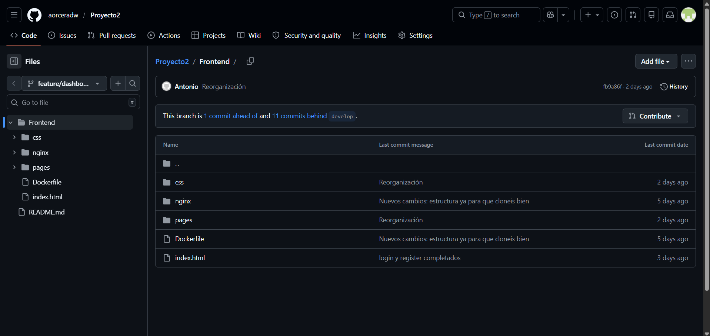
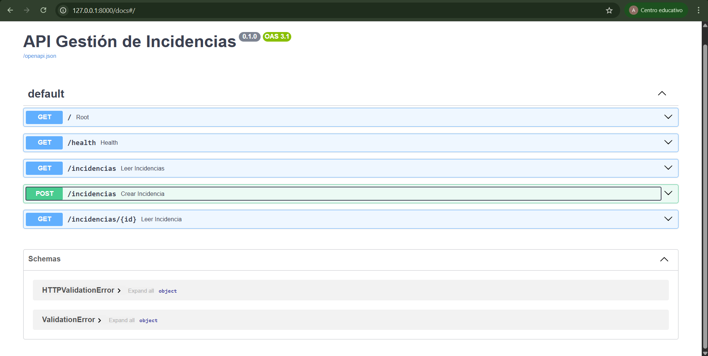
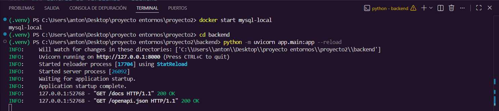

# Proyecto de Gestión de Incidencias — Backend API + Panel de Control
 
## Descripción General
 
Este documento recoge el trabajo realizado por **Antonio José** en el proyecto de Gestión de Incidencias, que abarca dos partes diferenciadas: el desarrollo del **panel de control (dashboard)** en el frontend, y la implementación de la **API REST con FastAPI** en el backend.
 
---
 
## PARTE 1 — Panel de Control (Dashboard)
 
### Descripción de la Tarea
 
Desarrollo del panel principal `dashboard.html` para la gestión y visualización de incidencias por parte del administrador. El objetivo es proporcionar una visión global del estado del sistema y herramientas de búsqueda rápida.
 
### Cumplimiento de Requisitos
 
A continuación se detalla cómo se ha implementado cada punto solicitado en el alcance funcional del proyecto:
 
**1. Visualización de Datos (Tabla de Incidencias)**
 
Se ha implementado una tabla profesional para listar las incidencias, incluyendo campos para ID, Título, Prioridad y Estado. Cada fila incluye un botón de acción con un icono de ojo (`<i class="fas fa-eye">`) para acceder a los detalles.
 
**2. Panel de Estadísticas**
 
Se ha creado una sección superior con tarjetas de resumen que muestran el Total de incidencias, las Abiertas y las Críticas. Se han aplicado colores semánticos (verde para abiertas, rojo para críticas) para facilitar la lectura rápida de datos.
 
**3. Filtros y Buscador**
 
Se ha incluido un campo de búsqueda funcional por ID o título con un icono integrado. Se ha implementado un selector de estados (Abiertas, Cerradas) para filtrar la información mostrada.
 
**4. Animaciones e Interactividad Avanzada**
 
Se han incorporado efectos en botones (el botón de "Nueva Incidencia" incluye un efecto de brillo y elevación al pasar el ratón), un selector animado con efecto 3D de inclinación al hacer hover, y navegación configurada para que la incidencia #1024 redirija a la página de detalle.
 
**5. Diseño Responsivo**
 
El panel es totalmente adaptable; en dispositivos móviles, las estadísticas y la sección de búsqueda se reorganizan en una sola columna para mantener la usabilidad.
 
### Control de Versiones — Frontend
 
Desarrollo realizado íntegramente en la rama independiente `feature/dashboard`, gestionando la integración con la rama `develop` mediante un flujo de trabajo colaborativo basado en Pull Requests.


 
### Archivos Clave
 
- `Frontend/dashboard.html` — estructura y lógica del panel
- `Frontend/css/estilosDashboard.css` — estilos y animaciones
---
 
## PARTE 2 — Backend API REST con FastAPI
 
### Descripción de la Tarea
 
Implementación del backend de la aplicación usando **FastAPI**, incluyendo los endpoints necesarios para la gestión de incidencias, la conexión con la base de datos mediante SQLAlchemy, y la configuración del servidor con Uvicorn.
 
### Tecnologías Utilizadas
 
El backend se ha desarrollado con las siguientes herramientas y librerías: FastAPI como framework principal, Uvicorn como servidor ASGI, SQLAlchemy como ORM para la comunicación con la base de datos, PyMySQL como driver de conexión MySQL, python-dotenv para la gestión de variables de entorno, y cryptography para la autenticación segura con MySQL 8.
 
### Endpoints Implementados
 
El archivo `backend/app/main.py` expone los siguientes endpoints:
 
**`GET /`** — Endpoint raíz que confirma que la API está activa. Devuelve un mensaje de estado con `{"status": "ok", "mensaje": "API de Incidencias funcionando"}`.
 
**`GET /health`** — Endpoint de salud pensado para que Docker o AWS puedan comprobar que el servicio responde correctamente.
 
**`GET /incidencias`** — Devuelve el listado completo de incidencias. Admite dos parámetros opcionales de filtrado: `estado` y `prioridad`. Si se incluyen en la URL, la consulta se filtra automáticamente; si no se incluyen, devuelve todas las incidencias.
 
**`GET /incidencias/{id}`** — Devuelve una incidencia concreta buscándola por su ID numérico.
 
**`POST /incidencias`** — Crea una nueva incidencia a partir de los datos recibidos en el cuerpo de la petición, la persiste en la base de datos y devuelve el objeto creado con su ID generado.


 
### Configuración CORS
 
Se ha configurado el middleware CORS con `allow_origins=["*"]` para permitir que el frontend, aunque se sirva desde un puerto o dominio distinto, pueda hacer peticiones a la API sin ser bloqueado por el navegador.
 
### Variables de Entorno
 
La conexión con la base de datos se gestiona a través de un archivo `.env` (nunca subido a GitHub, ya incluido en `.gitignore`) con las siguientes variables:
 
```
DB_HOST=<host de la base de datos>
DB_PORT=3306
DB_USER=<usuario>
DB_PASSWORD=<contraseña>
DB_NAME=incidencias_db
ENVIRONMENT=<development|production>
```
 
En local se ha utilizado un contenedor Docker con MySQL 8 para las pruebas, y en producción se conectará a la instancia **Amazon RDS** configurada por Ángela.
 
### Prueba en Local
 
Para verificar el correcto funcionamiento de la API antes del despliegue, se arranca el servidor con el siguiente comando desde la carpeta `backend`:
 
```bash
python -m uvicorn app.main:app --reload
```


 
Accediendo a `http://127.0.0.1:8000/docs` se puede ver la documentación interactiva generada automáticamente por FastAPI (Swagger UI), donde se pueden probar todos los endpoints directamente desde el navegador.
 
 

### Control de Versiones — Backend
 
El desarrollo se ha realizado en la rama `feature/api-antonio`, siguiendo el flujo GitFlow establecido por el equipo:
 
```bash
# Crear la rama desde develop actualizado
git checkout develop
git pull origin develop
git checkout -b feature/api-antonio
 
# Tras cada cambio, actualizar dependencias y hacer commit
pip freeze > requirements.txt
git add .
git commit -m "feat: descripción del cambio"
git push origin feature/api-antonio
```
 
La integración con `develop` se ha gestionado mediante Pull Requests revisadas por la coordinadora del proyecto.
 
### Archivos Clave
 
- `backend/app/main.py` — lógica principal de la API y definición de endpoints
- `backend/requirements.txt` — dependencias del proyecto actualizadas
---
 
## Desarrollador
 
**Antonio José** — Proyecto de Gestión de Incidencias de Soporte Técnico
 
Módulo: Entornos de Desarrollo