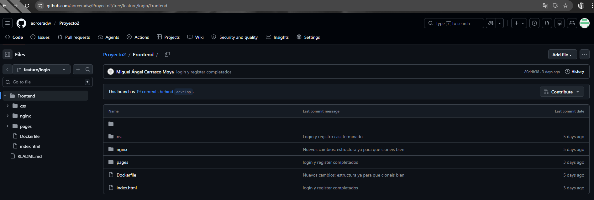

# Proyecto de Gestión de Incidencias: Frontend y Backend

## Descripción de la Tarea
Desarrollo de las interfaces de acceso (**index.html**) y registro (**registro.html**) para el sistema de soporte técnico, junto con la definición del modelo de datos de incidencias en el backend mediante SQLAlchemy.

---

## PARTE 1 — Frontend: Acceso y Registro de Usuarios

### Descripción
El objetivo es proporcionar una puerta de entrada segura, intuitiva y totalmente responsiva para los diferentes roles de la empresa.

### Cumplimiento de Requisitos

#### 1. Diseño Responsivo y Estética Profesional
- Se ha creado una hoja de estilos centralizada (`estilosLogin.css`) utilizando variables CSS para mantener la consistencia visual.
- El diseño es **completamente responsivo**, adaptándose a cualquier dispositivo (móvil, tablet o PC) mediante el uso de Flexbox y unidades relativas.
- Se han utilizado degradados modernos para el fondo y tarjetas con sombras suaves para mejorar la experiencia de usuario.


#### 2. Formulario de Registro con Validación Visual
- Se han incluido campos obligatorios (`required`) para Nombre Completo, Usuario y Contraseña.
- Se ha añadido un campo específico de **Confirmar Contraseña** con un icono de escudo diferenciador.
- Los iconos de **FontAwesome** se han integrado en cada campo para facilitar la identificación rápida de los datos requeridos.

#### 3. Flujo de Navegación y Redirección
- El formulario de Login incluye un selector de **Rol en la empresa** (Empleado, Técnico, Administrador) para la futura gestión de permisos.
- Se ha configurado el atributo `action` en ambos formularios para redirigir automáticamente al **dashboard.html**.
- Se han establecido enlaces de navegación cruzada entre el Login y el Registro.

### Control de Versiones
Desarrollo realizado en la rama independiente `feature/login`, siguiendo las buenas prácticas de GitFlow.



---

## PARTE 2 — Backend: Modelo de Datos de Incidencias

### Descripción
Definición del modelo de base de datos para la entidad **Incidencia** utilizando SQLAlchemy como ORM, dentro de la arquitectura FastAPI del proyecto.

### Tecnologías utilizadas
- **SQLAlchemy** → ORM para la definición y gestión del modelo de datos
- **PyMySQL** → conector entre Python y la base de datos MySQL en Amazon RDS
- **FastAPI** → framework backend sobre el que se integra el modelo

### Modelo implementado

```python
from sqlalchemy import Column, Integer, String, Text
from .database import Base

class Incidencia(Base):
    __tablename__ = "incidencias"

    id = Column(Integer, primary_key=True, index=True)
    titulo = Column(String(200), nullable=False)
    descripcion = Column(Text)
    prioridad = Column(String(20), default="media")
    estado = Column(String(20), default="abierta")
    reportado_por = Column(String(100))
```

### Campos definidos
- **id** → identificador único autoincremental y clave primaria
- **titulo** → título de la incidencia, obligatorio, máximo 200 caracteres
- **descripcion** → descripción detallada del problema, tipo texto largo
- **prioridad** → nivel de prioridad de la incidencia, valor por defecto "media"

### Proceso de trabajo
1. Activación del entorno virtual del proyecto
2. Instalación de dependencias: `pip install sqlalchemy pymysql`
3. Implementación del modelo en `backend/app/models.py`
4. Actualización de dependencias: `pip freeze > requirements.txt`
5. Subida del código en rama independiente `feature/models-miguel`
6. Pull Request hacia `develop` para revisión del equipo

### Control de Versiones
Desarrollo realizado en la rama independiente `feature/models-miguel`, siguiendo la metodología GitFlow. El código ha sido revisado mediante Pull Request antes de ser integrado en `develop`.

---

## Desarrollador
- **Desarrollado por:** Miguel Á. Carrasco Moya
- **GitHub:** mcarmoy